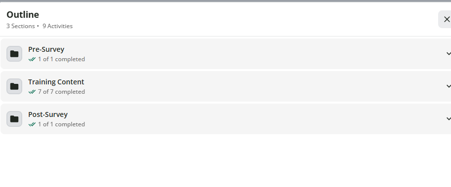
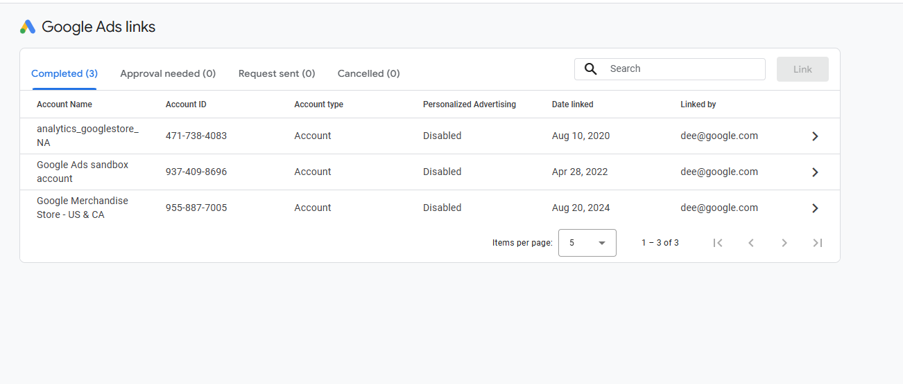

## 1. Module Completion

*Evidence of completing all submodules for the GA4 301 module.*



------------------------------------------------------------------------

## 2. Evidence Screenshots

### Figure 1: Admin → Product Links

*Note: Using the Google Sample Demo Account. Access to manage active integrations is restricted, but successful navigation to the Product Links interface in the Admin panel is demonstrated below.*



------------------------------------------------------------------------

## 3. Workflow Diagram

*This diagram illustrates the data flow from the initial website interaction to the final business outcome.*
```{mermaid}
graph LR
  A[Marketplace Website] -->|User adds item to cart| B(Google Analytics 4)
  B -->|Audience Creation| C{Identify Cart Abandoners}
  C -->|Data Shared| D[Google Ads Retargeting]
  D -->|Outcome Metric| E((Increased Return On Ad Spend))
```

## Short Responses

### Most Valuable Integration for My CEP

**Integration: Google Ads**

For a marketplace CEP, the **Google Ads integration** would deliver the
most immediate activation value. The GA4 ↔ Google Ads link enables
bidirectional data sharing — GA4 audiences (like the cart abandoners
shown in the workflow above) can be pushed directly into Google Ads as
remarketing lists, and Google Ads conversion data flows back into GA4
for unified attribution reporting. This closes the loop between behavioral
insight and paid media spend, which is critical for a marketplace where
the cost-per-acquisition must stay below the platform's average transaction
margin. Rather than relying on Google Ads' native pixel alone, importing
GA4's richer event-based signals (e.g., users who viewed 3+ listings but
never initiated checkout) allows for more precise bid adjustments and
audience exclusions — reducing wasted spend on users already converted.

---

### GA4 Audience for Activation

**Audience Name: High-Intent Non-Converters**

| Parameter | Detail |
|---|---|
| **Who is in it** | Users who viewed a product listing **3 or more times** within a 7-day window but did **not** trigger a `purchase` or `begin_checkout` event |
| **What they did** | Demonstrated repeated purchase intent through multiple listing views, indicating familiarity with the product — but encountering friction before conversion |
| **Activation channel** | Google Ads remarketing — served a time-limited discount or social proof ad (e.g., "X people bought this today") |
| **Membership duration** | 14 days (aligns with typical marketplace consideration window) |

This audience is high-value because they have already moved well past
awareness — the retargeting message only needs to resolve a conversion
barrier (price hesitation, trust gap, or distraction), not rebuild intent
from scratch.

---

### BigQuery Export Analysis

**Analysis: Multi-Touch Attribution Across the Full Conversion Path**

The GA4 UI's attribution reporting is limited to **last-click** or a few
pre-set models, and it does not expose the raw event sequences needed
to reconstruct individual user journeys. With BigQuery access, I would
query the raw `events_*` tables to perform **session-level path analysis**
— identifying the exact sequence of traffic sources, pages visited, and
micro-conversions (listing views, saves, seller profile views) that preceded
every completed purchase. This analysis would reveal which touchpoints are
being systematically undervalued in the default GA4 attribution model, and
allow me to reallocate budget toward the channels that genuinely initiate
purchase intent rather than just close it — something the GA4 UI cannot
surface at the raw event grain.
---
